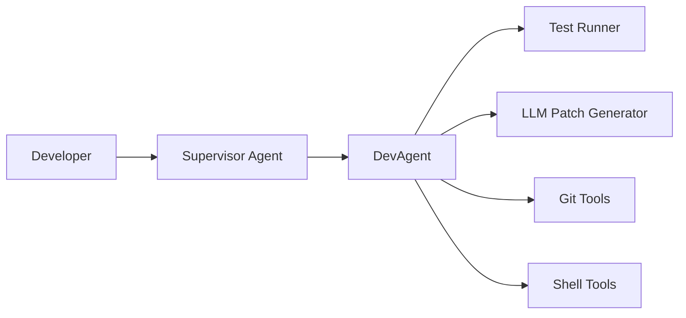

# 🤖 Dev Agent

AutoGen-based multi-agent system for automated test fixing.

## 🎯 Overview

Dev Agent is an intelligent automation tool that:

1. **Runs** your project's tests to identify failures
2. **Generates** minimal code patches using local LLMs
3. **Iterates** until all tests pass
4. **Commits** fixes and optionally opens pull requests

Built on Microsoft's [AutoGen](https://github.com/microsoft/autogen) framework with a focus on local, privacy-preserving LLM backends.

## 🚀 Quick Start

```bash
# Install dev-agent
pip install dev-agent

# Run on your project
dev-agent /path/to/your/project
```

## 📋 Development Status

This project follows strict **Test-Driven Development (TDD)**. Current phase:

- [x] **Phase 0**: Repository & CI scaffold
- [ ] **Phase 1**: Test runner module
- [ ] **Phase 2**: LLM patch generator
- [ ] **Phase 3**: AutoGen orchestrator loop
- [ ] **Phase 4**: CI/packaging/configuration
- [ ] **Phase 5**: Advanced features & maintenance

## 🏗️ Architecture



## 🛠️ Contributing

See [CONTRIBUTING.md](CONTRIBUTING.md) for detailed guidelines.

**Key requirements:**
- Follow TDD: RED → GREEN → REFACTOR
- All code must pass `black`, `isort`, `flake8`, `mypy --strict`
- Use local LLM backends only (no OpenAI API keys)
- Maintain ≥90% test coverage

## 📖 Documentation

- [Project Outline](docs/PROJECT-OUTLINE.md) - Development roadmap
- [Agent Architecture](docs/AGENT-ARCHITECTURE.md) - System design
- [Prompt Guidelines](docs/PROMPT-GUIDELINES.md) - LLM interaction specs

## 🔒 Security

- Whitelisted shell commands only
- Git patches validated before application
- No external code execution during tests
- Local LLM inference (privacy-preserving)

## 📄 License

MIT License - see [LICENSE](LICENSE) for details.

---

*Built with ❤️ using AutoGen and local LLMs*
