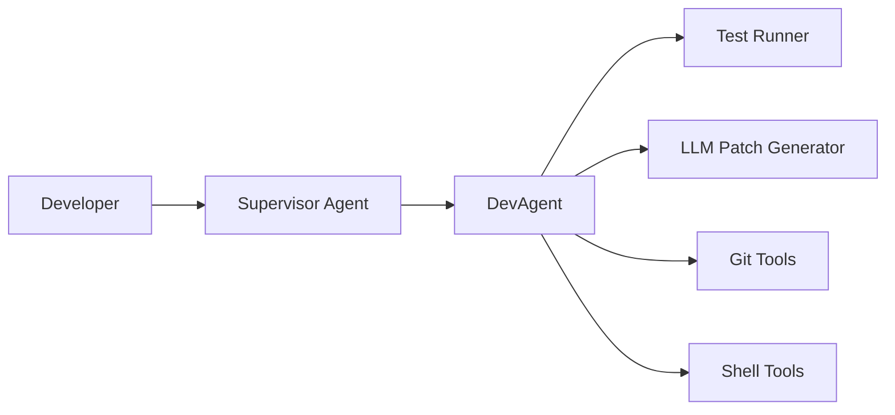

# 🤖 Dev Agent

AutoGen-based multi-agent system for automated test fixing.

## 🎯 Overview

Dev Agent is an intelligent automation tool that:

1. **Runs** your project's tests to identify failures
2. **Generates** minimal code patches using local LLMs
3. **Iterates** until all tests pass
4. **Commits** fixes and optionally opens pull requests

Built on Microsoft's [AutoGen](https://github.com/microsoft/autogen) framework with a focus on local, privacy-preserving LLM backends.

## 🚀 Quick Start

### Dev Agent (Low-level)

```bash
# Install dev-agent
pip install dev-agent

# Run on your project
dev-agent /path/to/your/project
```

### Supervisor Agent (High-level)

The Supervisor Agent provides a high-level interface for breaking down complex feature descriptions into subtasks:

```bash
# Run supervisor with a story description
supervisor-agent run --story "Create a calculator with add and subtract functions"

# Use custom config
supervisor-agent run --story "Add user authentication" --config my-config.yaml

# Dry-run to see the execution plan
supervisor-agent run --story "Implement file upload feature" --dry-run
```

**Example output:**
```json
{
  "story": "Create a calculator with add and subtract functions",
  "subtasks": [
    {"id": 1, "description": "Create a calculator", "status": "completed"},
    {"id": 2, "description": "Add functions", "status": "completed"}
  ],
  "approval": {
    "status": "approved",
    "message": "✅ Approved: All 2 subtasks completed successfully",
    "summary": "Completed work for: Create a calculator with add and subtract functions"
  }
}
```

### GitHub Action Usage

To use Dev-Agent as a reusable Action in your workflow, add:

```yaml
uses: rhythmatician/dev-agent@v0.1.1
with:
  config: dev-agent.yaml
  test-command: "pytest --maxfail=1"
  max-iterations: "5"
  auto-pr: "true"
```

**Complete workflow example:**

```yaml
name: "Auto-fix Tests with Dev Agent"
on:
  push:
    branches: [ main ]
  pull_request:
    branches: [ main ]

jobs:
  dev-agent:
    runs-on: ubuntu-latest
    permissions:
      contents: write
      pull-requests: write
    steps:
      - uses: actions/checkout@v4
        with:
          token: ${{ secrets.GITHUB_TOKEN }}
          fetch-depth: 0
      
      - name: Run Dev Agent
        uses: rhythmatician/dev-agent@v0.1.1
        with:
          test-command: "pytest -v"
          max-iterations: "3"
          auto-pr: "true"
```

## 📋 Development Status

This project follows strict **Test-Driven Development (TDD)**. Current phase:

- [x] **Phase 0**: Repository & CI scaffold
- [ ] **Phase 1**: Test runner module
- [ ] **Phase 2**: LLM patch generator
- [ ] **Phase 3**: AutoGen orchestrator loop
- [ ] **Phase 4**: CI/packaging/configuration
- [ ] **Phase 5**: Advanced features & maintenance

## 🏗️ Architecture



## ⚙️ Configuration

Dev Agent uses YAML configuration files. Example `agent.config.yaml`:

```yaml
# LLM configuration for different agent roles
agents:
  supervisor:
    backend: "ollama"
    model: "phi"
  dev_agent:
    backend: "llama-cpp"
    model: "/models/codellama-13b.Q4_K_M.gguf"

test_command: "pytest --maxfail=1"
max_iterations: 5

git:
  remote: "origin"
  branch_prefix: "dev-agent/fix"
  auto_pr: true

metrics:
  enabled: true
```

**Supported LLM backends:**
- `ollama`: Local Ollama server
- `llama-cpp`: Direct llama.cpp integration
- `openai`: OpenAI API (for development)
- `codellama`: CodeLlama specific optimizations

## 🛠️ Contributing

See [CONTRIBUTING.md](CONTRIBUTING.md) for detailed guidelines.

**Key requirements:**
- Follow TDD: RED → GREEN → REFACTOR
- All code must pass `black`, `isort`, `flake8`, `mypy --strict`
- Use local LLM backends only (no OpenAI API keys)
- Maintain ≥90% test coverage

## 📖 Documentation

- [Project Outline](docs/PROJECT-OUTLINE.md) - Development roadmap
- [Agent Architecture](docs/AGENT-ARCHITECTURE.md) - System design
- [Prompt Guidelines](docs/PROMPT-GUIDELINES.md) - LLM interaction specs

## 🔒 Security

- Whitelisted shell commands only
- Git patches validated before application
- No external code execution during tests
- Local LLM inference (privacy-preserving)

## 📄 License

MIT License - see [LICENSE](LICENSE) for details.

---

*Built with ❤️ using AutoGen and local LLMs*
