# 🗂️ AGENT-ARCHITECTURE.md

This document specifies the architecture and message flow for the **Dev Agent** system.
It formalises the roles, conversation schema, and stop-conditions that the orchestrator (`dev_agent.py`) must enforce.

---

## 1. Roles

| Role ID      | Description                                                     | Backend Model (default)            |
|--------------|-----------------------------------------------------------------|------------------------------------|
| **Developer**| Human client or high-level ChatGPT session that provides phase specs. | N/A (external)                     |
| **Supervisor**| Reviews patches, critiques design, and ultimately approves.      | _Thinking_ checkpoint (e.g. `ollama:phi`) |
| **DevAgent** | Generates tests & code patches to satisfy the current phase.      | Code-capable LLM (`llama-cpp:codellama`) |
| **ShellTool**| Executes OS commands (test runner, git, etc.).                   | Thin Python wrapper                |
| **GitTool**  | Creates branches, applies diffs, commits, pushes, opens PRs.     | Thin Python wrapper                |

_All roles except **Developer** operate inside AutoGen’s `Assistant` abstraction._

---

## 2. Message Schema

Every AutoGen message is a JSON-serialised dict embedded in Markdown fences:

```jsonc
{
  "role":     "Supervisor" | "DevAgent" | "ShellTool" | "GitTool",
  "content":  "<natural language or diff>",
  "type":     "instruction" | "patch" | "output" | "status",
  "metadata": {
    "iteration": <int>,
    "test_name": "<pytest::nodeid>" | null,
    "approved":  true | false | null
  }
}
````

### Required Conventions

* **Supervisor** replies `"approved": true` to signal merge‐ready.
* **ShellTool** returns stdout/stderr in `"content"` plus `"status": exit_code`.
* **DevAgent** emits unified diffs inside \`\`\`\`diff fences and sets `"type": "patch"`.

---

## 3. Conversation Flow

```mermaid
sequenceDiagram
    participant Sup as Supervisor
    participant Dev as DevAgent
    participant Sh  as ShellTool
    participant Git as GitTool

    Sup->>Dev: Phase spec & context
    loop Until Sup approves OR max_iters
        Dev->>Sh: run test command
        Sh-->>Dev: output + first failure
        Dev->>Dev: craft prompt → local LLM
        Dev-->>Dev: unified diff
        Dev->>Git: apply_patch + commit
        Git-->>Dev: status
        Dev->>Sh: re-run tests
        Sh-->>Dev: green?
        alt All green
            Dev->>Sup: patch + report
            Sup-->>Dev: approve / critique
        else
            Dev->>Sup: interim status
            Sup-->>Dev: critique (optional)
        end
    end
    alt Approved
        Dev->>Git: push branch & open PR
    end
```



---

## 4. Stop Conditions

1. **Supervisor Approval** → push & PR, exit 0.
2. **`max_iterations` reached** → abort, exit 1.
3. **Unrecoverable Git error** → abort, exit 2.
4. **No failing tests on first run** → exit 0 (nothing to do).

---

## 5. Configuration Keys (excerpt)

```yaml
model:
  dev_agent: "llama-cpp:/models/codellama-13b.Q4_K_M.gguf"
  supervisor: "ollama:phi"
max_iterations: 5
test_command: "pytest --maxfail=1"
git:
  remote: "origin"
  branch_prefix: "dev-agent/fix"
  auto_pr: true
```

---

## 6. Security Notes

* **ShellTool** whitelists commands: `pytest`, `npm test`, `git`, `pip`, `npm`, `make`.
* Any other command is rejected and reported to Supervisor.
* Git patches are applied with `--check` first; failures roll back via `git reset --hard`.

---

*This architecture is the reference for all implementation phases. Any deviation must be documented and approved via PR review.*

```